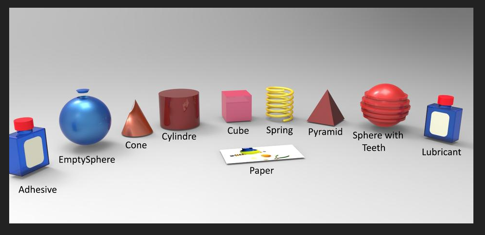

# RoboVision Project Requirements

[TOC]

## Intro

This document lists out all the requirements for the SOFA project RoboVision. It's a project that's being hosted by Fontys HS, Venlo for the second semester of year 2020. The purpose of the project is primarily to serve as a detailed insight into using ROS for extremely practical and complex robotics programming. The project is supposed to use a depth camera, robot arm and conveyor system all in unison to perform sorting work.

### Terms

ROS - Robot Operating System

### Scope

Scope goes as follows - object recognition software for depth camera, actuation for robot arm, actuation of the conveyor belt. As this is more so a proof of concept project than anything else, efficient documentation and at least one fully functioning component are the core of the end-goal. Outside of working with ROS to test and develop the hardware that we will be working with, everything else is outside of the scope of the project. The camera is supposed to recognize a set of specific objects, as such:

## Requirements

### General Project Requirements

### Object Recognition

### Robot Arm

### Conveyors