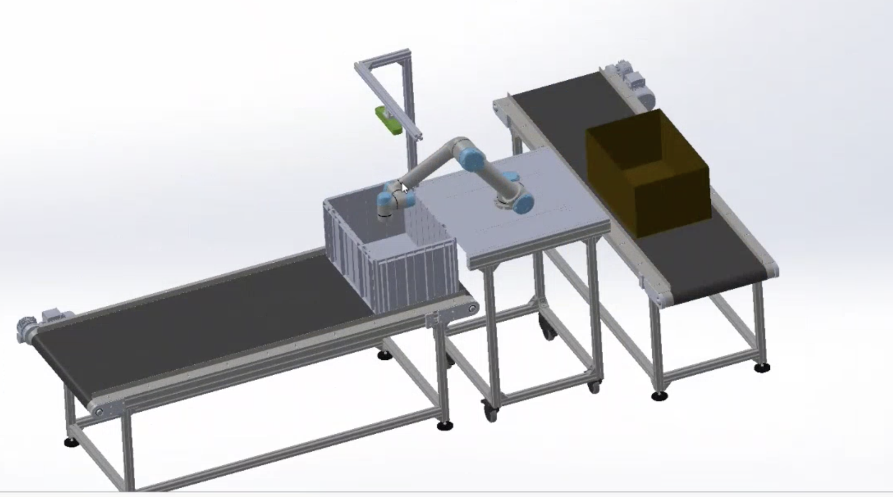
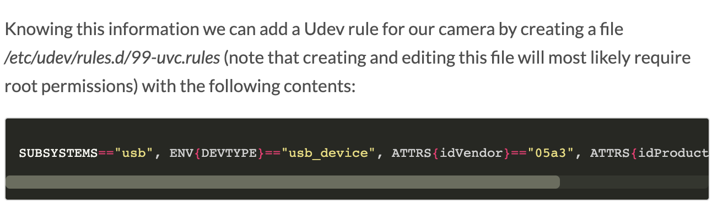
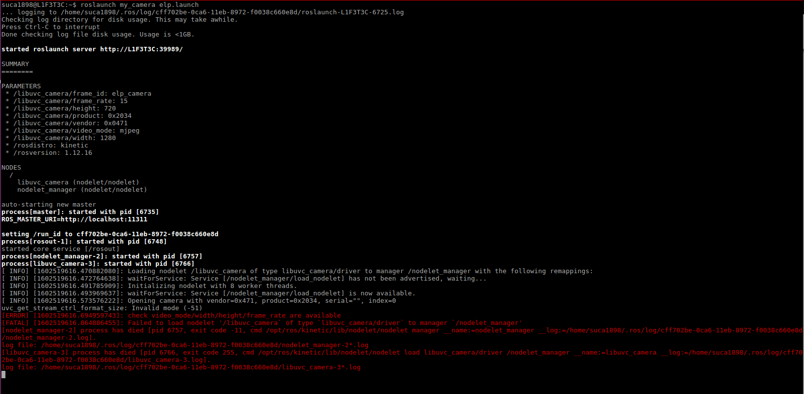
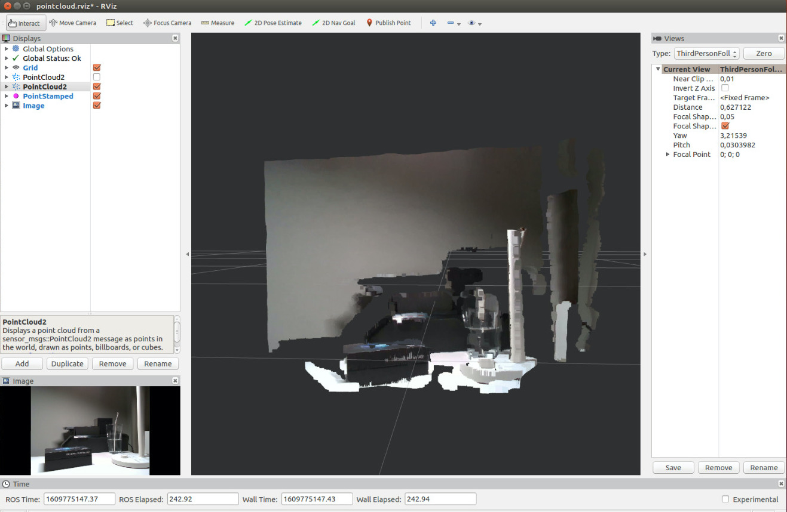
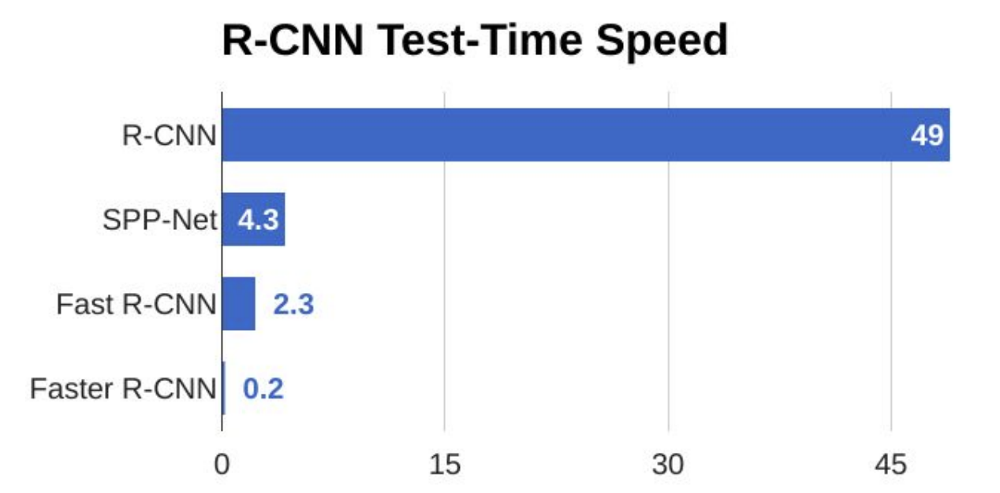

# Robovision project

- [Robovision project](#robovision-project)
  - [Project description](#project-description)
  - [Project goal](#project-goal)
  - [Set up phase](#set-up-phase)
    - [Set up the working environment](#set-up-the-working-environment)
    - [Learn and experience programming with ROS](#learn-and-experience-programming-with-ros)
    - [Working with D435 camera](#working-with-d435-camera)
        - [Set up the RealSense D435 camera](#set-up-the-realsense-d435-camera)
        - [Subscriber node to the RealSense D435 camera](#subscriber-node-to-the-realsense-d435-camera)
  - [Object recognition](#object-recognition)
      - [Object Analytics in ROS](#object-analytics-in-ros)
      - [OpenCV library](#opencv-library)
      - [OpenCV with newer GPUs (3080)](#opencv-with-newer-gpus-3080)
  - [Machine learning algorithms](#machine-learning-algorithms)
    - [CNN](#cnn)
    - [R-CNN](#r-cnn)
    - [Fast R-CNN](#fast-r-cnn)
    - [Faster R-CNN](#faster-r-cnn)
    - [Mask RCNN](#mask-rcnn)
    - [YOLO — You Only Look Once](#yolo--you-only-look-once)
    - [Our decision](#our-decision)
  - [Training a Mask RCNN model](#training-a-mask-rcnn-model)


## Project description

This is a project, funded, supervised and assisted by GTL(GreenTech Labs) and Fontys HS in Venlo. The purpose of the project is to use ROS(Robot Operating System) to develop a system that uses conveyors, a robot arm and a depth camera to establish a working robot-object-sorting automated system.

## Project goal

The Robovision project goal is to find out if Robot Operating System is suitable for building a cheaper version of the existing solution, which makes use of an expensive camera, the Pickit camera and is a black box system.

The point of the Robovision project, succinctly speaking, is to get a robot arm to pick up and put down objects effectively from box A into box B using a depth camera that is cheaper than it's industrial-standard counterpart. It's a sort of experiment for both cheaper solutions in depth cameras, as well as a testing grounds for the ROS(Robot Operating System) development environment in more practical fields. To put this to a list, it would go like this:

- Make the robot arm work with ROS code.
- Make the cheaper depth camera work with ROS code.
- Implement object recognition of the depth camera.
- Pick up and put down items from one box to another, using a robot arm.
- Document the entirety of this project(code, workflow diagrams, etc.) for later continuation.
- Learn and experience programming with ROS



## Set up phase

At the start of the project, not all of the team were acquainted with the Robot Operating System, so the first phase of the project was dedicated to introducing ourselves to ROS. Afterwards, the phase two consisted of getting the object recognition of the 3D shapes work with the depth camera, RealSense D435.

### Set up the working environment

The Robot Operating System (ROS) is an open source set of software libraries and tools that facilitates the development of robot applications. In order to program using ROS, we have to analyse and research the specific ROS version that would comply best for our project goal. Since we make use of the Intel Real Sense D435 camera, we chose to make use of the ROS Kinetic version. At the moment the decision was taken, it was the only available version that offered continuous integration and the documentation in place.

Source: http://wiki.ros.org/realsense2_camera

When making the decision, we took into consideration that it is the oldest and best maintained version of the ROS, so the community of people using this particular version is bigger comparing with the other two newer versions (ROS Melodic and ROS Neotic). This would represent an advantage for us, since we could find more shared information online.

In order to use ROS Kinetic, it is required to make use of Ubuntu Xenial 16.04 version.

Installation instructions can be found here: http://wiki.ros.org/kinetic/Installation

### Learn and experience programming with ROS

Our team started reading and learning how the new operating system is working by following the official tutorials provided by ROS. (ROS tutorials: [http://wiki.ros.org/ROS/Tutorials](http://wiki.ros.org/ROS/Tutorials)) Each member, individually, had the responsibility to create their own environment and share the knowledge about their progress. 

After choosing ROS Kinetic as our distribution we tried to create a bootable stick, where Ubuntu 16.04 and ROS Kinetic would be installed, for portability purposes. Unfortunately, we didn't find a way to create a bootable stick with persistence memory, so every time the bootable stick was disconnected all the libraries of ROS and other packages were lost. Therefore, we dropped the idea of creating a bootable stick and vote for installing on our local machines. Despite the fact that all members were using a brand new Ubuntu system, more than often problems appears to be different for each of us.

Following the ROS installation from their official site, the overall installation was pretty straight forward, copying and pasting commands into the terminal. The installation took quite long and required a significant amount of memory, consisting of a variety of libraries and frameworks. Despite the fact that the official installation seems to be straight forward, it was pretty ambiguous and leave some important details and questions unanswered.

One problem was to create a ROS environment, where different dependencies can be installed or modify afterwards, so missing one dependency or reading one from a wrong place was a challenge. Following step by step the tutorial, all of the team members had problems setting this environment for the first time.
Testing this environment took us more than expected after the ROS environment was set up correctly accordingly to the official installation and other third party websites, testing the camera itself was a challenge. The first thing we did was to install the D435 software, from Intel, and try to see what the camera can do. After being able to manipulate the image and see that this camera has a 2D image and a 3D image, from where we can extract important information(i.e. width, height, the distance between 2 objects, etc.).

As a team we decided to break down the learning into 3 steps, each of them had the intent to help to get a better understanding of how we can use ROS.

- Make a node that can send out messages

  (ROS tutorial: http://wiki.ros.org/ROS/Tutorials/UnderstandingNodes)

  A node is an executable file that uses the ROS client library to communicate with other nodes. Nodes use topics to be able to share information between multiple files. In our case, we created a simple node that subscribes to the topics provided by the D435 camera and creates a publisher to be able to access the data.

- Multiple nodes that communicate with each other using ROS

  (ROS tutorial: http://wiki.ros.org/ROS/Tutorials/WritingServiceClient(python))

- Make a node that does a basic image recognition with the help of the laptop camera
  
  
    **Connecting laptop camera**
    To make the connection with laptop camera, using ROS, we made use of the following tutorial. https://msadowski.github.io/ros-web-tutorial-pt2-cameras/

    There might be errors you could encouter or different issues that are hardware related. Below, we have listed the problems we encountered and how we managed to solve them.
            
    <details>
    <summary>What can go wrong?</summary>

    **Pay attention to the udev rule**

    Find the camera device node path and get the correct 'looking at parent device' id (idProduct, idVendor) attributes in order to create a new udev rule.

    


    **Creating my_camera package**

    When you want to create the `my_camera` package, the syntax used in the tutorial is outdated. The following lines show the wright syntax. Also, the new package creates a dependency to the `libuvc-camera`, if you do not have it installed already, you should do it beforehand.

    ```
    # install libuvc-camera
    sudo apt-get install ros-kinetic-libuvc-camera
    # WRONG SYNTAX 
    catkin create pkg my_camera --catkin-deps libuvc_camera
    # CORECT SYNTAX catkin_create_pkg <package_name> [depend1] [depend2] [depend3]
    catkin_create_pkg my_camera libuvc_camera
    source devel/setup.bash
    catkin_make
    ```

    **[rospack] Error: package 'rqt_image_view' not found** 

    If you choose to work with image-view, you also have to install it on your machine.

    ``sudo apt-get install ros-kinetic-image-view``

    **Permission required to access the camera**

    In case you have troubles connecting to your laptop camera, as seen in the snippet below, you have to grant the required permissions.

    

    In order to fix this problem you need to identify the D435 camera by the following command `ls /dev/video*`. After you identified the new video device, you need to give it permission in order for ROS to be able to find and use the laptop camera. You will most probably need to repeat the same step also for the D435 camera, to grant write permission without altering user and group permissions. 

    `sudo chmod o+w /dev/bus/usb/00X/00Y`

    </details>
            
    **Basic object recognition with the laptop camera**

    The following tutorial was very useful in setting up a basic image recognition and play around with it. Do not forget to select /usb_cam/image_raw to get the  https://sudonull.com/post/14732-Detection-and-recognition-of-objects-from-the-camera-in-ROS-using-the-package-find_object_2d
            
    <details>
    <summary>What can go wrong?</summary>
    
    **E: Unable to locate package ros-kinetic-find-object-2d**

    You need to set up your sources.list and keys to get software from [packages.ros.org](http://packages.ros.org/). Following the instructions, you should be able to make it work.

    ```jsx
    sudo sh -c 'echo "deb <http://packages.ros.org/ros/ubuntu> $(lsb_release -sc) main" > /etc/apt/sources.list.d/ros-latest.list'
    sudo apt-key adv --keyserver hkp://ha.pool.sks-keyservers.net:80 --recv-key 421C365BD9FF1F717815A3895523BAEEB01FA116
    sudo apt-get update
    sudo apt-get install ros-kinetic-desktop-full
    ```

    **E: Unable to correct problems, you have held broken packages. (cause: broken catkin)**

    The following packages have unmet dependencies: catkin : Depends: python-catkin-pkg but it is not going to be installed E: Unable to correct problems, you have held broken packages.

    ```jsx
    sudo apt-get install ros-kinetic-catkin
    source /opt/ros/kinetic/setup.bash //source the ROS environment
    catkin_make
    ```

    **[rospack] Error: package 'uvc_camera' not found**

    Install the uvc-camera package for your ros distribution

    ```jsx
    sudo apt-get install ros-kinetic-uvc-camera
    ```
    </details>

### Working with D435 camera

After the environment was set up, our team divided into 3 groups in order for each member to have access to the D435 camera, because there were only 3 available cameras to work with.

##### Set up the RealSense D435 camera

Use the following links and follow the steps for setting up the packages you need to run the D-435 camera on your system.

https://github.com/IntelRealSense/realsense-ros#installation-instructions

In the event of an SDK2 error, try installing this.

https://github.com/IntelRealSense/librealsense/blob/master/doc/distribution_linux.md

Additionally, in the event of you trying to run the D-435, it doesn't work, the first thing I would recommend troubleshooting is making sure your system can use your USB port. Just do "lsusb" to see which port has `lsusb`. You should see some result like "Bus 002 Device 003: ID 8086:0b3a Intel Corp. ". Might be a different USB port. Whichever one it is, just do `sudo chmod o+w /dev/bus/usb/00X/00X` and in place of the Xs put your actual port numbers.

After all that, it should work. Try running

```
roslaunch realsense2_camera demo_pointcloud.launch
```

You should get an excellent little demo to play around with. If something else breaks, good luck - you're on your own.

Also, do not forget to install rviz, which is a 3D visualization tool for ROS. `sudo apt-get install ros-kinetic-rviz`

**Package version of the "realsense2" in CMakeLists.txt is wrong**

In case you get the following error when running `catkin_make clean`, you should change the realsense2 package version in the CMakeLists.txt.

```
CMake Warning at realsense-ros/realsense2_camera/CMakeLists.txt:43 (find_package):
  Could not find a configuration file for package "realsense2" that is
  compatible with requested version "2.41.0".

  The following configuration files were considered but not accepted:

    /opt/ros/kinetic/lib/x86_64-linux-gnu/cmake/realsense2/realsense2Config.cmake, version: 2.40.0


CMake Error at realsense-ros/realsense2_camera/CMakeLists.txt:47 (message):
```

At the end, you should be able to see the depth camera image using the rviz tool.




##### Subscriber node to the RealSense D435 camera

We managed to get the messages sent by the camera topic, using ROS and converted the received image bits into an image view with the help of opencv. https://github.com/Robovison/RoboVision_Robot/blob/develop/src/CameraSubscriber.py

## Object recognition

The crate holds the items that the robot arm needs to pick and transfer in another place. In order for the system to know where to place the robot arm, it needs data on where the object is placed inside the crate. Firstly, to get the data from the camera regarding the object and its location, the system has to recognize which object to inspect. For this, object recognition is used to understand what is in the crate and to retrieve the location of each item.

In order to implement object recognition, we looked at the different approaches that there are available.

### Object Analytics in ROS

From the first research session our first attempt was to use ros_object_analytics. It is a ROS wrapper developed by Intel, which can be used for real-time object detection, localization and tracking. https://github.com/intel/ros_object_analytics

The problem with this package is that it requires a list of dependencies, which we tried to install, but eventually consumed too much of our time and we decided to find another framework to achieve object recognition

Dependencies:

- https://github.com/intel/ros_opencl_caffe
- https://github.com/intel/ros_openvino_toolkit
- https://github.com/01org/caffe/tree/inference-optimize

### OpenCV library

After research on what technology to use for object recognition, we tried to find a way to implement it ourselves. The library we tried to use for this was OpenCV, which is is aimed for real-time computer vision and is broadly used for object detection.

We looked for examples that already exists and tried to find one that is the most appropriate for our project and would help us move forward.

https://github.com/IntelRealSense/librealsense/tree/master/wrappers/opencv

We wanted to dive deeper into what openCV has to offer and we have researched its functionalities and different examples that there are available out there.

https://dev.intelrealsense.com/docs/opencv-wrapper

https://www.youtube.com/watch?v=WQeoO7MI0Bs

https://www.youtube.com/watch?v=NkcIAmvPL7Y

https://www.youtube.com/watch?v=29k8HSqoqpI

Also, we made use of the openCV and created a basic image converter by subscribing to the `/camera/color/image_raw`.

https://github.com/Robovison/RoboVision_Robot/blob/test/Python-Image-Converter/src/ImageSubcriber.py

After some time and some more experiencing with OpenCV, the team realized that a machine learning algorithm is needed in order to build and train a model to recognize different types of items.

### OpenCV with newer GPUs (3080)
Our team experimented in using OpenCV with a newer video card, Nvidia 3080. It worked, we were able to use the library to do basic object detection. The installation guide can be found [here](https://github.com/Robovison/RoboVision_Robot/blob/documentation/handover/project_documentation/handover_documentation/installation_opencv_newGPU.md):

## Machine learning algorithms

In order to create the object recognition part of the project in an efficient way, we had to research the existing machine learning algorithms and find the most suitable one.

After research we found different types of algorithms that can be used in our scope.

### CNN

CNN is the most basic convolutional network used to classify the presence of the object within a region. The problem occurs when the object appears several times in different spatial locations, you have to select a huge number of regions and it would result in a computational blow up.

### R-CNN

R-CNN represents an improvement for the CNN method. It uses selective search to create a certain number of regions (e.g. 2000). The disadvantage is that it takes a lot of time to process each image, around 47 seconds per input. This means it cannot be implemented as a real time object detection and cannot be used in our case. Also, the selective search algorithm is a fixed algorithm. Therefore, no learning is happening at that stage. This could lead to the generation of bad candidate region proposals.

### Fast R-CNN

The approach is similar to the R-CNN algorithm. But, instead of feeding the region proposals to the CNN, we feed the input image to the CNN to generate a convolutional feature map.

The reason “Fast R-CNN” is faster than R-CNN is because you don’t have to feed 2000 region proposals to the convolutional neural network every time. Instead, the convolution operation is done only once per image and a feature map is generated from it.

### Faster R-CNN

Similar to Fast R-CNN, the image is provided as an input to a convolutional network which provides a convolutional feature map. Instead of using selective search algorithm on the feature map to identify the region proposals, a separate network is used to predict the region proposals.

Faster RCNN do detect small objects well since it has nine anchors in a single grid, however it fails to do real-time detection with its two step architecture.



### Mask RCNN

Mask RCNN is a deep neural network which has the goal to solve instance segmentation problem in machine learning. Instance Segmentation is the process of identifying each object inside an image at pixel level. This is the hardest task in computer vision compared to other sub types inside Image Segmentation. The other similar task can be:

1. Classification: Recognize that there is an object inside the image.
2. Semantic Segmentation: Recognize the pixels that belong to the object.
3. Object Detection: Recognize how many different objects are inside the image at different locations. Also, the overlapping objects are recognized.
4. Instance Segmentation: Recognize that there are different objects at different locations and which pixels belong to which object.

Mask RCNN , which stands for regional convolutional neural network, is working in two stages. In the first stage it scans the input image and it generates numerous different proposals on where an object might be located. Basically, it generates a ton of boxes in different places inside the image and passes them on. In the second stage, the proposals are analyzed, classified. Bounding boxes are  generated for each recognizes instance.

As an addition, Mask RCNN adds another layer on the defined object, a pixel level mask that helps differentiate between more objects. These stages are connected to the backbone structure, which usually is ResNet50 or ResNet101. The backbone structure is a convolutional neural network that has multiple layers: the first layers detects low-level features, such as edges or corners, and the last layers detecting detailed features which we recognize as objects.

### YOLO — You Only Look Once

YOLO or You Only Look Once is an object detection algorithm much different from the region based algorithms seen above. In YOLO a single convolutional network predicts the bounding boxes and the class probabilities for these boxes.

YOLO is orders of magnitude faster(45 frames per second) than other object detection algorithms. The limitation of YOLO algorithm is that it struggles with small objects within the image, for example it might have difficulties in detecting a flock of birds. This is due to the spatial constraints of the algorithm.

### Our decision

The decision is to use Mask RCNN for our project, a decision that was heavily influenced by our use case. The team needed technology that can recognize, with high accuracy, between different items inside a crate. This process should be fast and reliable. The feature which adds a mask to every object recognized made our decision clear.

The other major framework that was considered by our team was YOLO, which is another fast and accurate real-time object detection system. The framework outputs only bounding boxes around the recognized objects. Since the crate is filled with different items in different orders the bounding boxes can easily overlap and make coordination of the robot arm harder. Thus, having a mask on each object makes it easier to calculate what the dimensions of the object are and its location.

[Installation for Mask RCNN](installation_mask_rcnn.md)

## Training a Mask RCNN model

To use the model to recognize different types of objects, it has to be trained so it can learn the objects. For this we need a dataset with different images with the same object, but from different point of views. These images have to be annotated, basically draw out every object inside the image and label it. In order to annotate the dataset we used `https://www.makesense.ai/` and `https://gitlab.com/vgg/via`, both of them work with the same outputed structure, a JSON file with the labels, coordinates and other data. This JSON will be fed, along with the images, in our Mask RCNN algorithm to train the model. In our experiments we used coco weights to train and try out the algorithm. A good machine is needed for the training process, a good GPU helps a lot, be aware to setup the tensorflow to use the GPU! 
Training a model can also be done in the cloud. Our research found that Amazon Web Services, Google Cloud and Floyd are companies that offer cloud training for additional costs at a fairly high speed.

