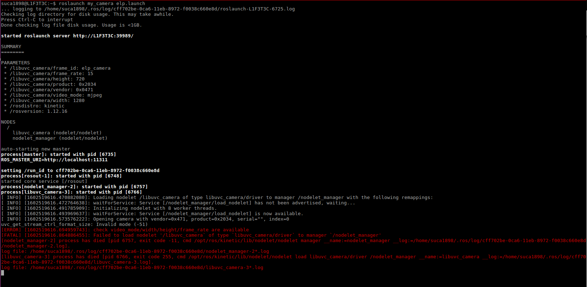

## Connecting laptop camera: 

To make the connection with laptop camera, using ROS, we made use of the following tutorial. https://msadowski.github.io/ros-web-tutorial-pt2-cameras/

There might be errors you could encouter or different issues that are hardware related. Below, we have listed the problems we encountered and how we managed to solve them.

#### What can go wrong?

**Pay attention to the udev rule**

Find the camera device node path and get the correct 'looking at parent device' id (idProduct, idVendor) attributes in order to create a new udev rule.


**Creating my_camera package**

When you want to create the `my_camera` package, the syntax used in the tutorial is outdated. The following lines show the wright syntax. Also, the new package creates a dependency to the `libuvc-camera`, if you do not have it installed already, you should do it beforehand.

```
# install libuvc-camera
sudo apt-get install ros-kinetic-libuvc-camera
# WRONG SYNTAX 
catkin create pkg my_camera --catkin-deps libuvc_camera
# CORECT SYNTAX catkin_create_pkg <package_name> [depend1] [depend2] [depend3]
catkin_create_pkg my_camera libuvc_camera
source devel/setup.bash
catkin_make
```

**[rospack] Error: package 'rqt_image_view' not found** 

If you choose to work with image-view, you also have to install it on your machine.

``sudo apt-get install ros-kinetic-image-view``

**Permission required to access the camera**

In case you have troubles connecting to your laptop camera, as seen in the snippet below, you have to grant the required permissions.



In order to fix this problem you need to identify the D435 camera by the following command `ls /dev/video*`. After you identified the new video device, you need to give it permission in order for ROS to be able to find and use the laptop camera. You will most probably need to repeat the same step also for the D435 camera, to grant write permission without altering user and group permissions. 

`sudo chmod o+w /dev/bus/usb/00X/00Y`

